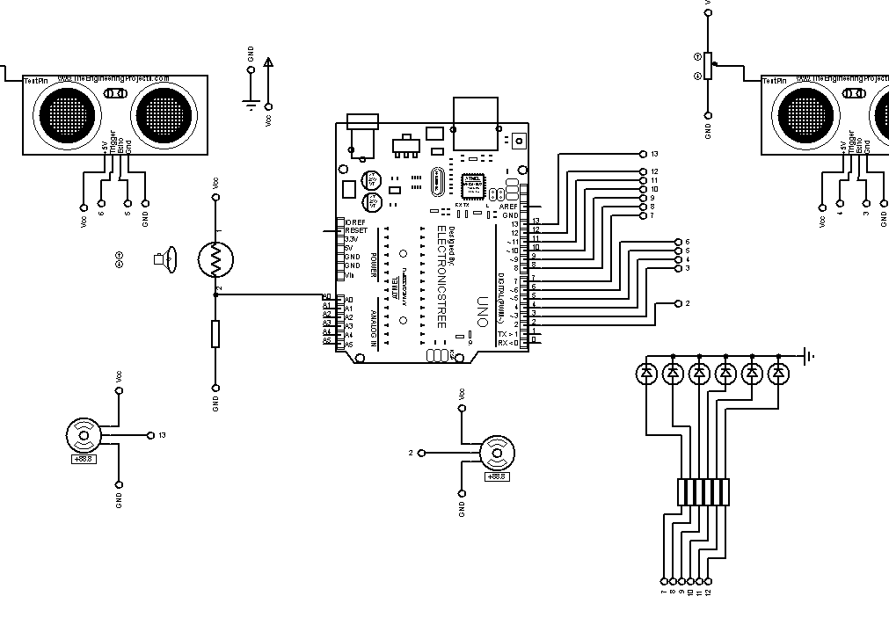

# Ponte-Basculante

Este projeto foi desenvolvido como parte do exame da disciplina **Programação de Dispositivos Eletrónicos** do curso de Ciência da Computação. Ele simula uma ponte basculante automatizada, capaz de detectar a aproximação de um barco e realizar a abertura e fechamento das rampas de forma inteligente, utilizando sensores e atuadores.

## Descrição do Projeto

A ponte basculante automatizada tem como principal objetivo garantir a passagem segura de embarcações e veículos, controlando automaticamente as rampas de acesso. O sistema utiliza sensores para detectar a aproximação de barcos e aciona motores para levantar ou abaixar a ponte conforme necessário.

Principais funcionalidades:
- Detecção da aproximação de barcos usando sensores.
- Abertura automática da ponte para permitir a passagem das embarcações.
- Fechamento seguro da ponte para restaurar o tráfego normal de veículos.
- Indicação visual do status da ponte usando LEDs ou display.

## Tecnologias Utilizadas

- Linguagem: C++
- Plataforma: Arduino (ou plataforma similar para prototipagem eletrônica)

## Como Executar

1. **Pré-requisitos:**
   - Placa Arduino (ou compatível)
   - Sensores de proximidade (ex: ultrassônico)
   - LEDs ou displays
   - Motores/Servos para movimentação da ponte
   - Cabos e protoboard

2. **Clonando o repositório:**
   ```sh
   git clone https://github.com/kingsonPaxe/Ponte-Basculante.git
   cd Ponte-Basculante
   ```

3. **Abrindo o projeto:**
   - Abra o arquivo principal do código (`.ino` ou `.cpp`) na IDE do Arduino.

4. **Carregando o código:**
   - Conecte sua placa Arduino ao computador.
   - Faça o upload do código para a placa via IDE Arduino.

5. **Montagem do circuito:**
   - Siga o esquema de ligação sugerido nos comentários do código para conectar sensores, LEDs e motores à placa.
   
   

6. **Execução:**
   - Alimente a placa Arduino e observe o funcionamento automático da ponte conforme a detecção de barcos.

## Contribuição

Contribuições são bem-vindas! Sinta-se à vontade para abrir issues ou enviar pull requests.

## Licença

Este projeto está sob a licença MIT.